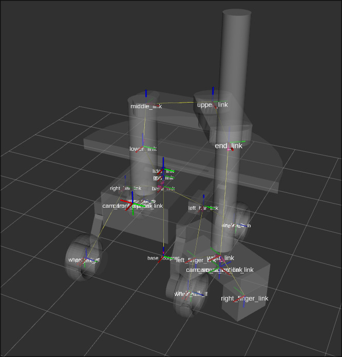
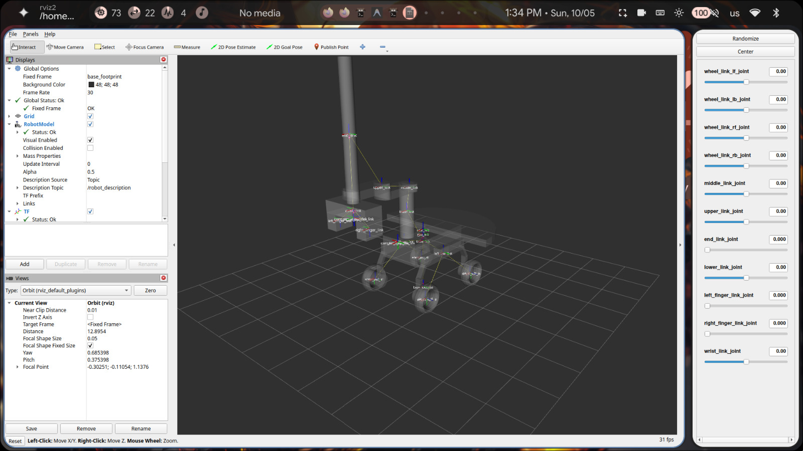
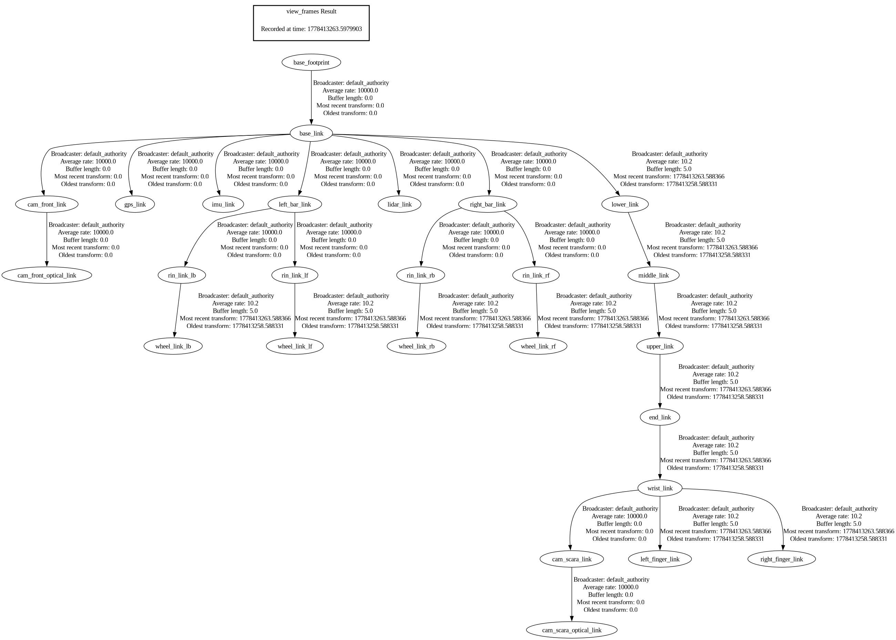
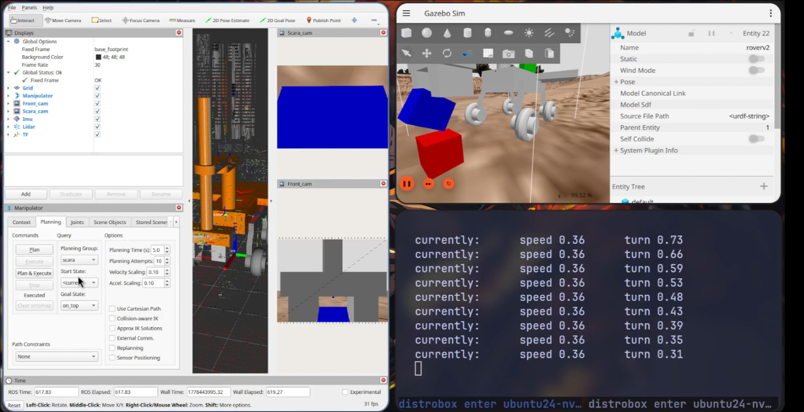
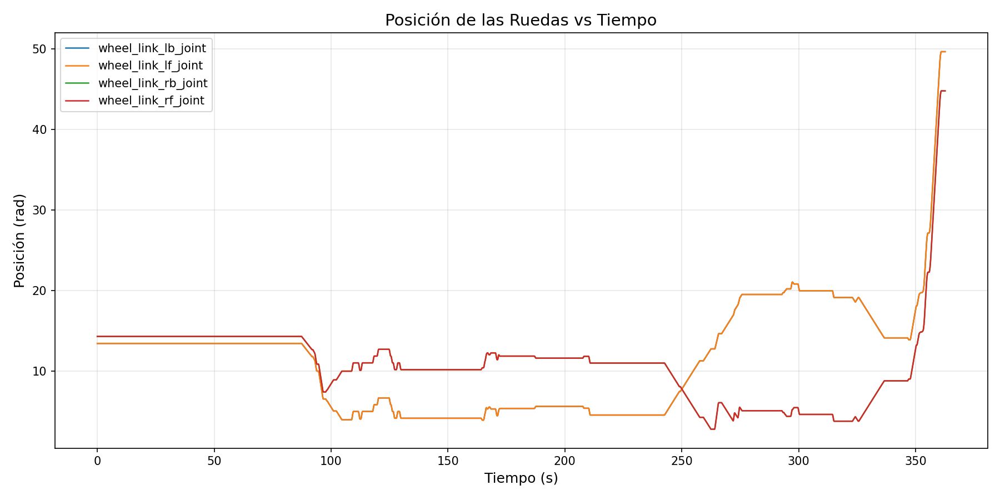
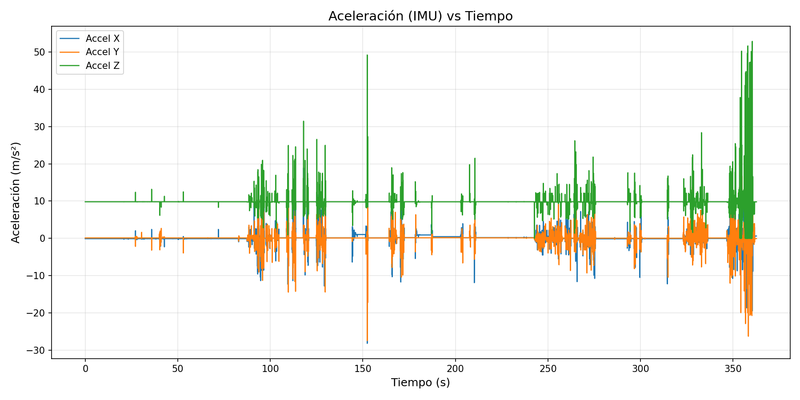
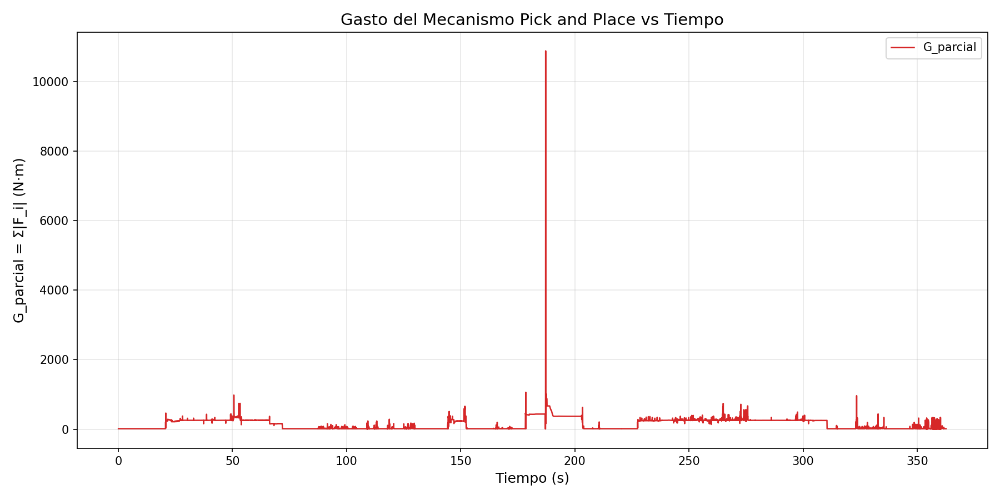

# Práctica 3 — Simulación de Robots usando Middleware

> Modelado y Simulación de Robots — GIRS, URJC  
> Javier González

## Índice

1. [Descripción del Robot](#descripción-del-robot)
2. [Captura de RViz](#captura-de-rviz)
3. [Árbol de Transformadas](#árbol-de-transformadas)
4. [Imágenes de la Simulación](#imágenes-de-la-simulación)
5. [Análisis de Datos — Gráficas](#análisis-de-datos--gráficas)
6. [Rosbag](#rosbag)
7. [Instrucciones de Ejecución](#instrucciones-de-ejecución)

---

## Descripción del Robot

El robot `roverv2` es una plataforma móvil tipo rover con 4 ruedas, un brazo SCARA de 4 GDL (lower, middle, upper, end) y un efector final tipo gripper con 2 dedos prismáticos. Cuenta con los siguientes sensores:

- IMU (centro del robot)
- Cámara frontal (`Front_cam`)
- Cámara en el extremo del manipulador (`Scara_cam`)
- LiDAR
- GPS

---

## Captura de RViz

### Articulaciones desplazadas con TFs visibles



En esta captura se muestran los **TFs** de todas las articulaciones visibles sobre el modelo del robot en RViz, con al menos cuatro articulaciones del brazo claramente desplazadas respecto a su posición de reposo: `lower_link_joint`, `middle_link_joint`, `upper_link_joint` y `end_link_joint`.

### Interfaz de joint_state_publisher_gui



Captura del robot en posición de reposo mostrando la interfaz de **joint_state_publisher_gui** en el panel derecho, con los sliders de todas las articulaciones (`wheel_link_lf_joint`, `wheel_link_lb_joint`, `wheel_link_rf_joint`, `wheel_link_rb_joint`, `middle_link_joint`, `upper_link_joint`, `end_link_joint`, `lower_link_joint`, `left_finger_link_joint`, `right_finger_link_joint`, `wrist_link_joint`). Los TFs del robot son visibles en la vista 3D.

---

## Árbol de Transformadas



El árbol de transformadas muestra la jerarquía completa de links del robot, partiendo de `base_footprint` → `base_link`, con las ramas de las cuatro ruedas, el brazo SCARA completo (lower → middle → upper → end → wrist), el gripper de dos dedos (`left_finger_link` y `right_finger_link`), y los sensores (lidar, GPS, cámaras frontal y del brazo).

📄 [Descargar TF tree en PDF](screenshots/tf_tree.pdf)

---

## Imágenes de la Simulación

### Sujetando el cubo verde en el aire


El robot ha recogido el cubo verde situado frente a él y lo mantiene en el aire con el efector final del brazo SCARA. En la vista de la cámara del brazo (`Scara_cam`) y en la vista frontal de Gazebo se aprecia el cubo verde suspendido mientras el rover maniobra hacia su compartimento de depósito.

### A punto de colocar el cubo azul sobre el rojo



El robot ha recogido el cubo azul (ubicado a su izquierda) y se dispone a depositarlo sobre el cubo rojo (ubicado a su derecha). En la vista de Gazebo se aprecia el cubo azul sostenido por el gripper, posicionado directamente sobre el cubo rojo. El estado de MoveIt en el panel izquierdo muestra el goal state `on_top`.

---

## Análisis de Datos — Gráficas

Las gráficas se generan a partir del rosbag capturado durante la teleoperación completa (~360 s).

### Posición de las Ruedas vs Tiempo



La gráfica muestra la posición angular acumulada (en radianes) de las cuatro ruedas a lo largo de los ~360 s de la teleoperación. Se distinguen claramente tres fases:

1. **0–90 s (manipulación del cubo verde):** Todas las ruedas permanecen estables en su posición inicial (~13–14 rad). El rover está completamente estacionario mientras el brazo SCARA recoge y deposita el cubo verde.
2. **90–250 s (maniobras de reposicionamiento):** Las ruedas delanteras (`lf` y `rf`) muestran variaciones bruscas y asimétricas correspondientes a avances, retrocesos y giros diferenciales del rover para alcanzar el cubo azul (izquierda) y después posicionarse junto al cubo rojo (derecha). Las ruedas traseras (`lb` y `rb`) mantienen posiciones más constantes, comportamiento típico del controlador de tracción diferencial utilizado.
3. **250–360 s (recorrido recto de 10 m):** Las ruedas delanteras acumulan un incremento pronunciado y continuo hasta alcanzar ~50 rad (`lf`) y ~44 rad (`rf`), correspondiente al avance en línea recta de 10 m sin interrupciones.

### Aceleración (IMU) vs Tiempo



La gráfica muestra los tres ejes de aceleración registrados por la IMU durante los ~360 s de operación:

- **Eje Z (verde):** Se mantiene en torno a +9.81 m/s² durante toda la operación, correspondiente a la componente gravitacional. Los picos puntuales que sobresalen de esta línea base son vibraciones del chasis durante los desplazamientos.
- **Ejes X e Y (azul y naranja):** Permanecen cerca de 0 durante el reposo y muestran picos en los siguientes momentos:
  - **~20–50 s:** Pequeñas perturbaciones iniciales al arrancar la grabación con el brazo en movimiento.
  - **~90–130 s:** Primera fase dinámica de desplazamiento lateral y giro del rover para aproximarse al compartimento.
  - **~150 s:** Pico aislado de gran magnitud en el eje Z (~50 m/s²), provocado por una detención o colisión brusca del rover.
  - **~160–220 s:** Aceleraciones correspondientes a la navegación para alcanzar el cubo azul y el cubo rojo.
  - **~250–360 s:** Tramo recto final de 10 m con oscilaciones continuas típicas de la velocidad constante aplicada sobre el terreno de simulación.

### Gasto del Mecanismo Pick and Place vs Tiempo



El gasto G_parcial se define como la suma de los valores absolutos de los esfuerzos en las articulaciones del mecanismo pick-and-place:

$$G_{parcial} = \sum_{i} |F_i|$$

Articulaciones incluidas: `lower_link_joint`, `middle_link_joint`, `upper_link_joint`, `end_link_joint`, `wrist_link_joint`, `left_finger_link_joint`, `right_finger_link_joint`.

Comportamiento observado:

1. **0–90 s (operación sobre cubo verde):** Picos moderados de ~300–900 N·m durante los movimientos del brazo para recoger y depositar el cubo verde. El gasto cae prácticamente a cero cuando el brazo está en reposo entre movimientos.
2. **~185 s (pico máximo ~11 000 N·m):** El pico más destacado de la operación corresponde a una transición brusca del brazo, posiblemente durante la recogida del cubo azul o la reconfiguración del gripper bajo carga. Este pico puntual refleja el esfuerzo de compensación de gravedad en una configuración singular del brazo.
3. **200–360 s (colocación del cubo azul y navegación final):** Picos menores y más espaciados correspondientes a los ajustes finos del brazo durante la colocación del cubo azul sobre el rojo, seguidos de gasto prácticamente nulo durante el recorrido recto final (brazo en posición de reposo).

---

## Rosbag

📥 **Descarga del rosbag:** [practica3_rosbag2/](practica3_rosbag2/)

El rosbag contiene exclusivamente los topics requeridos:

| Topic | Tipo | Mensajes |
|---|---|---|
| `/cmd_vel` | `geometry_msgs/msg/Twist` | 2 470 |
| `/imu` | `sensor_msgs/msg/Imu` | 10 984 |
| `/joint_states` | `sensor_msgs/msg/JointState` | 7 249 |

**Duración:** ~362 s | **Distro:** ROS 2 Jazzy | **Formato:** MCAP

---

## Instrucciones de Ejecución

### Requisitos

- ROS 2 Jazzy
- Gazebo Harmonic
- MoveIt 2
- Paquetes: `teleop_twist_keyboard`, `ros_gz`, `gz_ros2_control`

### Lanzamiento

```bash
# Terminal 1: Simulación + controladores + MoveIt
ros2 launch myrover deploy_rover.launch.py

# Terminal 2: Teleoperación
ros2 run teleop_twist_keyboard teleop_twist_keyboard

# Terminal 3: Grabación del rosbag
ros2 bag record /cmd_vel /imu /joint_states -o practica3_rosbag
```

### Generación de gráficas

```bash
pip install rosbags matplotlib
python3 graph_rosbag.py practica3_rosbag2/
```
