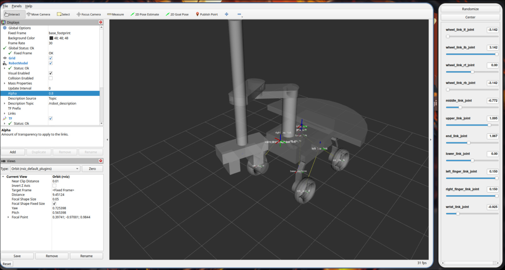
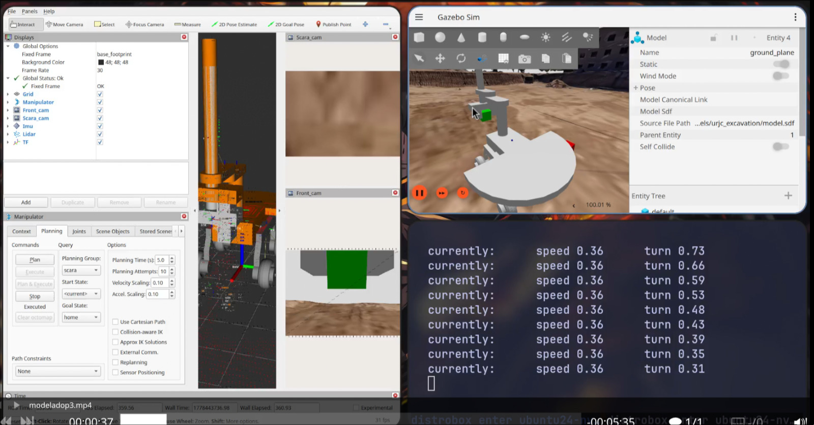
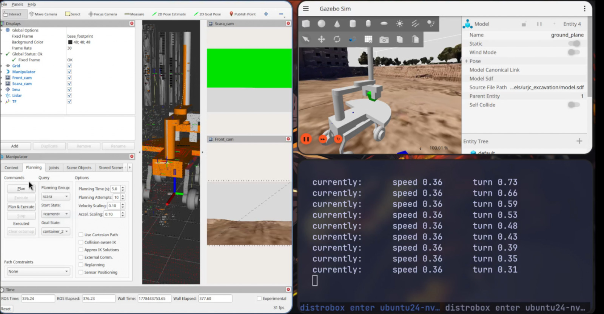
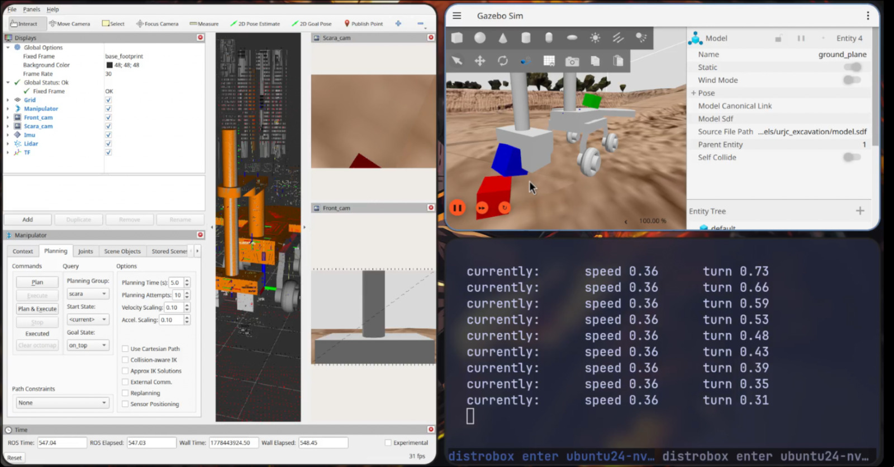
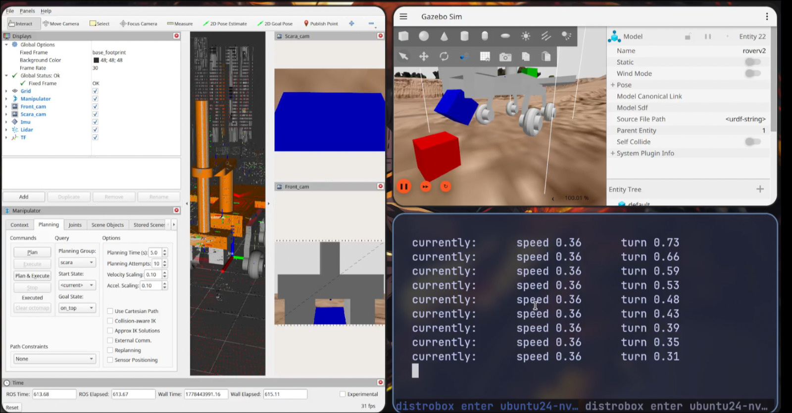
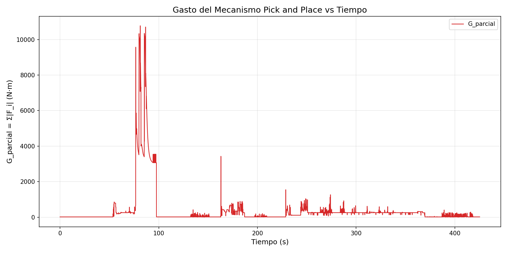

# Práctica 3 — Simulación de Robots usando Middleware

> Modelado y Simulación de Robots — GIRS, URJC  
> Javier González

## Índice

1. [Descripción del Robot](#descripción-del-robot)
2. [Vídeo de la Práctica](#vídeo-de-la-práctica)
3. [Captura de RViz](#captura-de-rviz)
4. [Árbol de Transformadas](#árbol-de-transformadas)
5. [Imágenes de la Simulación](#imágenes-de-la-simulación)
6. [Análisis de Datos — Gráficas](#análisis-de-datos--gráficas)
7. [Rosbag](#rosbag)
8. [Instrucciones de Ejecución](#instrucciones-de-ejecución)

---

## Vídeo de la Práctica

[▶ Ver vídeo de la teleoperación completa (~425 s)](https://github.com/JavideuS/practicafinal-modelado/releases/download/demo/modeladop3.mp4)

---

## Descripción del Robot

El robot `roverv2` es una plataforma móvil tipo rover con 4 ruedas, un brazo SCARA de 4 GDL (lower, middle, upper, end) y un efector final tipo gripper con 2 dedos prismáticos. Cuenta con los siguientes sensores:

- IMU (centro del robot)
- Cámara frontal (`Front_cam`)
- Cámara en el extremo del manipulador (`Scara_cam`)
- LiDAR
- GPS

---

## Captura de RViz

### Articulaciones desplazadas con TFs visibles



En esta captura se muestran los **TFs** de todas las articulaciones visibles sobre el modelo del robot en RViz, con al menos cuatro articulaciones del brazo claramente desplazadas respecto a su posición de reposo: `lower_link_joint`, `middle_link_joint`, `upper_link_joint` y `end_link_joint`.

### Interfaz de joint_state_publisher_gui


Captura del robot en posición de reposo mostrando la interfaz de **joint_state_publisher_gui** en el panel derecho, con los sliders de todas las articulaciones (`wheel_link_lf_joint`, `wheel_link_lb_joint`, `wheel_link_rf_joint`, `wheel_link_rb_joint`, `middle_link_joint`, `upper_link_joint`, `end_link_joint`, `lower_link_joint`, `left_finger_link_joint`, `right_finger_link_joint`, `wrist_link_joint`). Los TFs del robot son visibles en la vista 3D.

---

## Árbol de Transformadas


El árbol de transformadas muestra la jerarquía completa de links del robot, partiendo de `base_footprint` → `base_link`, con las ramas de las cuatro ruedas, el brazo SCARA completo (lower → middle → upper → end → wrist), el gripper de dos dedos (`left_finger_link` y `right_finger_link`), y los sensores (lidar, GPS, cámaras frontal y del brazo).

📄 [Descargar TF tree en PDF](screenshots/views/tf_tree.pdf)

---

## Imágenes de la Simulación

### Sujetando el cubo verde en el aire



El robot recoge el cubo verde que estaba enfrente de él y lo mueve hasta la posición de home para poder transicionar al depósito. En la vista de la cámara del robot (`Front_cam`) y en la vista frontal de Gazebo se puede apreciar al cubo suspendido. Aunque podemos ver que (`Scara_cam`) se buggea y en ves de mostrar verde o verde y parte del suelo, solo muestra el suelo. 

Luego podemos ver en la siguiente imagen el cubo verde agarrado en la posición de lobby, después de hacer la transición desde home. En esta podemos ver que (`Front_cam`) deje de ver el brazo ya que no esta orientado hacia ese lado y que en (`Scara_cam`) se ve perfectamente el cubo verde (arreglándose el error de visualización).



### A punto de colocar el cubo azul sobre el rojo



En este caso el robot ya recogio el cubo azul a su izquierda y esta apunto de transicionarlo para ponerlo encima del cubo rojo de la derecha. En esta primera toma estamos en la posición on_top que fue creada para facilitar la aproximación al cubo rojo. Sin embargo, durante la ejecución me di cuena de que no servía de mucho ya que después de agarrar el cubo, este se movio y no estaba en la posición normal/esperada.


En esta nueva iteración podemos ver que al no agarrar el cubo bien, este se deslizo y choca ligeramente con el cubo rojo antes de poder colocarlo encima. Para solucionar esto, el mismo moveit2 te permite modificar los joints envés de ir a una posición preguardada, así que simplemente decidí reducir un poco el end_joint para poder tener un poco más de altura que permita soltar el bloque sin directamente colisionar con el cubo rojo.  



Ya en está última imagen podemos ver que tiene mejor altura y está apunto de dejar el cubo azul sobre el rojo. Para diferenciar con la primera captura tenemos que comparar lo que ven scara y front cam. Se nota que la posición del end_joint es mucho más alta, permitiendo realizar correctamente el pick and place sin colisiones.

---

## Análisis de Datos — Gráficas

Las gráficas se generan a partir del rosbag capturado durante la teleoperación completa (~425 s).
Para ayudar a reanalizar tiempos y movimientos tenemos el script de replicación de ros bags @replay_from_bag.py

Es importante notar que en todos los gráficos los primeros 60 segundos pasa absolutamente nada. Y eso se debe a que para hacer las iteraciones consistentes y facilitar el análisis, tenemos que esperar un tiempo inicial a que la simulación de gazebo se calibre y el cubo verde deje de moverse. De esta manera no nos preocupamos de mover el scara en un instante de tiempo concreto sino de hacer los movimientos correctos en los espacios correctos.

Hace que los análisis sean más reproducibles y explicables.

### Posición de las Ruedas vs Tiempo


La gráfica muestra la posición angular acumulada (en radianes) de las cuatro ruedas a lo largo de los ~425 s de la teleoperación. Se distinguen claramente tres fases:

1. **0–120 s (manipulación del cubo verde):** Todas las ruedas permanecen estables en su posición inicial (0 radianes). Durante este período el rover esta completamente estacionario y solo utilizamos el SCARA y gripper.
2. **120–150 s (Reposicionamiento hacia el cubo rojo):** En este caso empezamos a mover el rover para recoger el cubo rojo. Como podemos ver, las ruedas delanteras se mueven de forma inversa/espejada para permitir girar el rover sobre su eje. Esta estrategia consistente en mover las ruedas derechas en sentido contrario a las izquierdas, de tal forma que esa posición permite girar mientras te quedas prácticamente en el mismo sitio.
3. **150-260 s (manipulación del cubo rojo):**  Podemos ver que todo este momento el rover mantiene la posición de las ruedas, esto se debe a que estamos tratando de recoger el cubo rojo. Sin embargo esta parte me tardó mucho ya que la primera que lo agarró, se cayó del scara y tuve que repetirlo, por eso podemos ver ligeros movimientos de ruedas alrededor de los *200-210 s*. Gracias a estos giros pude recolocar el cubo rojo en posición y finalmente llevarlo a la posición de on_top.
4. **260-340 s (Reposicionamiento hacia el cubo azul):** En este caso empezamos a mover el rover para llevar el cubo rojo a la posición del cubo azul. Por eso podemos visualizar de nuevos los cambios en espejo de las ruedas. Sin embargo, como esta vez giramos en sentido contrario, podemos ver como los joints cambian completamente de sentido, ahorita las ruedas izquierdas giran en sentido positivo, mientras que las derechas en sentido negativo
5. **340-390 s (Manipulación cubo rojo sobre el azul)**: Esta etapa corresponde a colocar el cubo rojo sobre el azul. Podemos ver que una vez conseguí la posición correcta en la etapa anterior, no hace falta volver a mover el robot, solo el scara. Esta es la parte que se muestra en las capturas anteriores que tengo que ligeramente modificar visualmente una posición ya que la altura configurada en on_top se quedaba un poco larga de altura.

3. **390–425 s (recorrido recto de 10 m):** Esta es la etapa final del recorrido y corresponde a los últimos 10 metros hacia adelante. Podemos fijarnos en esto ya que por primera vez todas las ruedas giran en el mismo sentido (positivo). Ya que queremos por primera vez avanzar en línea recta

### Aceleración (IMU) vs Tiempo


La gráfica muestra los tres ejes de aceleración registrados por la IMU durante los ~425 s de operación:

Lo primero que hay que notar es que en reposo o cuando no se mueve el robot las componentes en x e y del acelerometro son 0, lo cual tiene todo el sentido ya que el objeto esta quieto. Sin embargo, el eje Z en reposo podemos ver que ronda los 9.81 m/s^2, que es el valor de la aceleración debida a la gravedad.

Los picos que vemos a lo largo de la gráfica corresponden a momentos en los que el rover se encuentra en movimiento. Así que debería coincidir con las etapas de movimientos explicadas en la gráfica anterior.

Alrededor de los 120 segundos vemos un pico. Que podemos relacionar directamente con el giro para obtener el cubo rojo. Luego vemos un poquito de ruido como a los 170-180 que probablemente corresponda con el balanceo del robot al mover el scara mientras intentaba coger el cubo rojo.

A los 200 podemos ver como el robot se empieza a mover de nuevo y esa es la parte que corresponde a cuando se me cayó el robot rojo y tuve que rotar el rover con el scara en posición nivel suelo (target) para tratar de reposicionar correctamente el cubo rojo y poder agarrarlo bien.

El siguiente gran pico es alrededor de los 260 segundos y es cuando rotamos el robot completamente hacia el otro lado para poder llevar el cubo rojo sobre el azul

El último pico es alrededor de los 390 segundos y es cuando avanzamos los 10 metros hacia adelante y por eso vemos que es el pico mayor y mas consistente.

En conclusión, el movimiento de las ruedas está altamenta relacionado con el acelerometro, exceptuando las vibraciones que podemos ver por el movimiento del scara.

### Gasto del Mecanismo Pick and Place vs Tiempo



El gasto G_parcial se define como la suma de los valores absolutos de los esfuerzos en las articulaciones del mecanismo pick-and-place:

$$G_{parcial} = \sum_{i} |F_i|$$

Articulaciones incluidas: `lower_link_joint`, `middle_link_joint`, `upper_link_joint`, y luego disminuyen. Esos instantes corresponden a la parte en la que trato de calibrar el cubo rojo para agarrarlo correctamente y me produce ciertos movimientos del scara que generan considerables gastos de fuerza.

Alrededor de los 220 segundos vemos como empieza a aumentar la fuerza y se mantiene durante un tiempo hata mas o menos los 360-370 segundos. Esto corresponde a toda la parte en la que movemos el cubo rojo sobre el azul y estamos constante manteniendo el cubo en el scara a la altura de on_top además de los fuerza extra cuando tratamos de ajsutar la altura para poder posicionarlo perfectamente sobre el cubo azul. Todos esos mini picos que vemos corresponden precisamente a esa parte en la que voy ajustando diferentes alturas  y alguna que otra vibración, ya que solo probé como 3 alturas pero veo ligeramente más picos que podrían a ligeros movimientos del robot para acercar o alejar el cubo para soltarlo.

Por último vemos que a los 380 ya se dejó completamente el cubo rojo y el gasto baja a cero y luego aumenta alrededos de los 400 que es cuando empezamos a mover al robot en línea recta por 10 metros


---

## Rosbag

📥 **Descarga del rosbag:** [practica3_rosbag_final/](practica3_rosbag_final/)

El rosbag contiene exclusivamente los topics requeridos:

| Topic | Tipo | Mensajes |
|---|---|---|
| `/cmd_vel` | `geometry_msgs/msg/Twist` | 1 155 |
| `/imu` | `sensor_msgs/msg/Imu` | 12 880 |
| `/joint_states` | `sensor_msgs/msg/JointState` | 8 501 |

**Duración:** ~425 s | **Distro:** ROS 2 Jazzy | **Formato:** MCAP

---

## Instrucciones de Ejecución

### Requisitos

- ROS 2 Jazzy
- Gazebo Harmonic
- MoveIt 2
- Paquetes: `teleop_twist_keyboard`, `ros_gz`, `gz_ros2_control`

### Lanzamiento

```bash
# Terminal 1: Simulación + controladores + MoveIt
ros2 launch myrover deploy_rover.launch.py

# Terminal 2: Teleoperación
ros2 run teleop_twist_keyboard teleop_twist_keyboard

# Terminal 3: Grabación del rosbag
ros2 bag record /cmd_vel /imu /joint_states -o practica3_rosbag_final
```

### Generación de gráficas

```bash
pip install rosbags matplotlib
python3 graph_rosbag.py practica3_rosbag_final/
```

### Replay de la situación

El script `replay_from_bag.py` reproduce la trayectoria completa en Gazebo, incluyendo los movimientos del brazo SCARA. Puede fallar en algunos casos extremos pero en general recrea bien la secuencia:

```bash
# Terminal 1: Simulación base
ros2 launch myrover robot_gazebo.launch.py

# Terminal 2: Controladores
ros2 launch myrover rover_controller.launch.py

# Terminal 3: Replay con visualización en Gazebo
python3 replay_from_bag.py practica3_rosbag_final/
```
